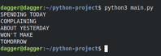

# text-taker
:satisfied: A text extracter python program that extracts text from an image that the user uploads.

<h3> Tech stack used: :octocat: </h3>

<li>python 3.6.9</li>
<li>Visual Code Studio</li>

<h3>Installation :gem: </h3>

1. **:round_pushpin: clone the repository.**

   ```shell
   $git clone https://github.com/Aman-zishan/text-taker.git

   ```
2. **:checkered_flag: navigate to the cloned repo folder.**

   ```shell
   $cd text-taker

   ```
3. **:construction: install the dependencies.**

   ```shell
   $pip install -r requirements.txt

   ```
4. **:diamonds: download the image and save it to a new directory 'img'.**

5. **:dart: Run the python script**
    ```shell
    
    #This command runs the main.py file and generates a text file with the text extracted from the image.
    
   $python3 main.py

   ```
   ## DEMO
   <p align="center">
        
